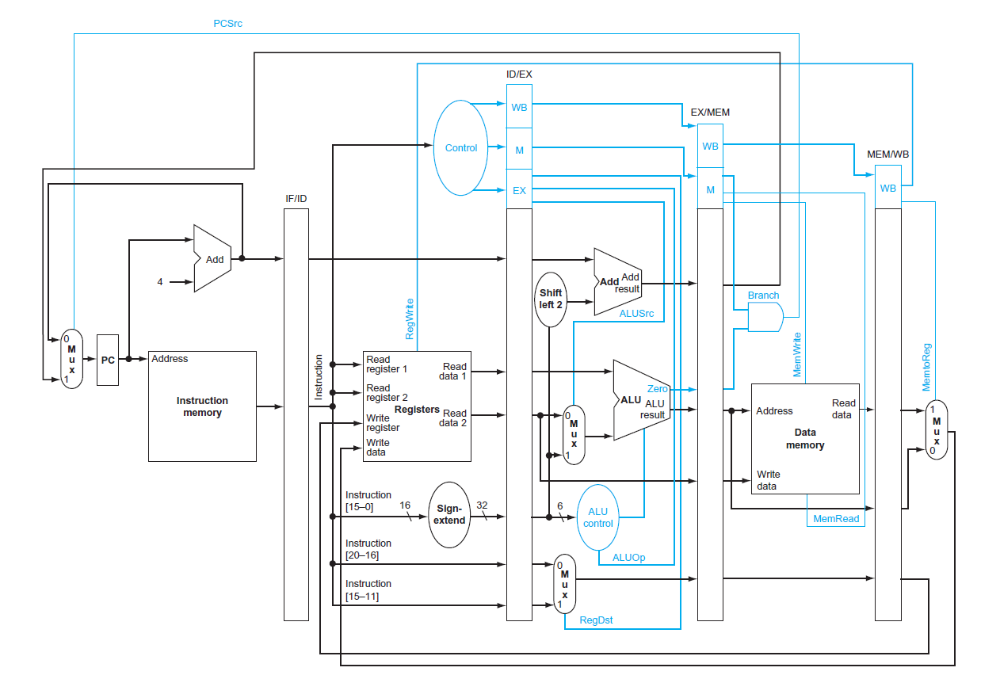

# 5-Pipelined CPU

## Basics
In this roject 3, we built up a simplified central processing unit (CPU) based on MIPS architecture (ISA) using the hardware description language (HDL) Verilog. CPU, one of the most important components in a computer architecture, performs in five basic stages, including instruction fetching (IF), instruction decoding (ID), execution (EX), memory access (MEM), and writing back operation (WB). There are several ways, such as single-cycle datapath, multi-cycle datapath, and pipelining datapath, to realize the five stages. In this project, we are going to implement a five-stage pipelined CPU.

## Design
The following diagram shows a general datapath of a pipelined-cpu.

To construct a basic CPU with complete functionality, it is important to figure out inputs and outputs of the hardware. The inputs of the CPU are a set of instructions fetched from the instruction RAM, a clock and a reset signal. The outputs required is the data RAM, which is used to store data written from the CPU.

Secondly, we implemented the five stages one by one, and then, use wires to connect each separate component together to form the complete CPU. The major components are the control unit, the register file, arithmetic logic unit (ALU), and buffers to transmit data properly and synchronously.
